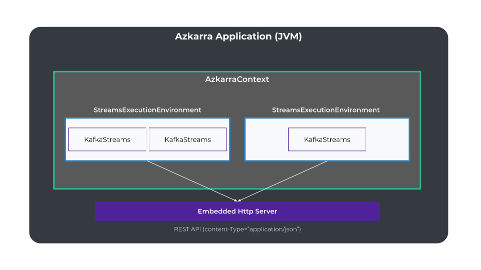

# Concepts
{: .no_toc }

## Table of contents
{: .no_toc .text-delta }

1. TOC
{:toc}

---

# Basic API Concepts

## AzkarraApplication

The `AzkarraApplication` is the high-level class which is used to bootstrap an Azkarra Streams application.

Its main responsibility is to initialize an `AzkarraContext` using a user-defined configuration which describe 
the `StreamsExecutionEnvironment` and the streams application to be executed.
 
The `AzkarraApplication` is also responsible for deploying an embedded HTTP server (if enable) which exposes the REST endpoints 
that can be used to manage registered topologies and to run streams instances.

## AzkarraContext

The `AzkarraContext` is responsible for configuring and running one ore more `StreamsExecutionEnvironment`.
By default, an `AzkarraContext` will always create a default `StreamsExecutionEnvironment` named `__default`.

## StreamsExecutionEnvironment

A `StreamsExecutionEnvironment` is responsible for creating, configuring and running one ore more `KafkaStreams` jobs.
The `StreamsExecutionEnvironment` interface provides methods for setting listeners (`StateRestoreListener`, `KafkaStreams.StateListener`) that are automatically set to all managed `Kafka Streams` instances.  

## TopologyProvider

This is the main interface that should be implemented by developers to provide `Topology` instances.
The `TopologyProvider` implementations are registered into the `AzkarraContext` and/or to `StreamsExecutionEnvironment`.

Note: Generally, you will deploy an Azkarra Streams application running a single StreamsExecutionEnvironment with a single Kafka Streams instance.

